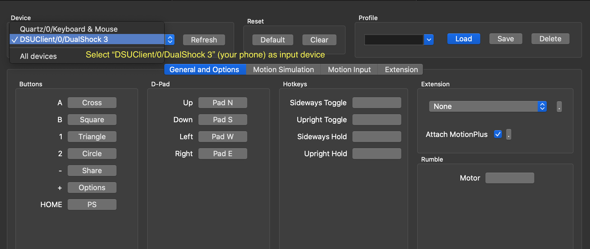
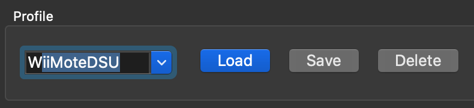
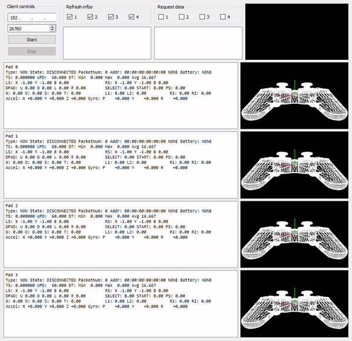
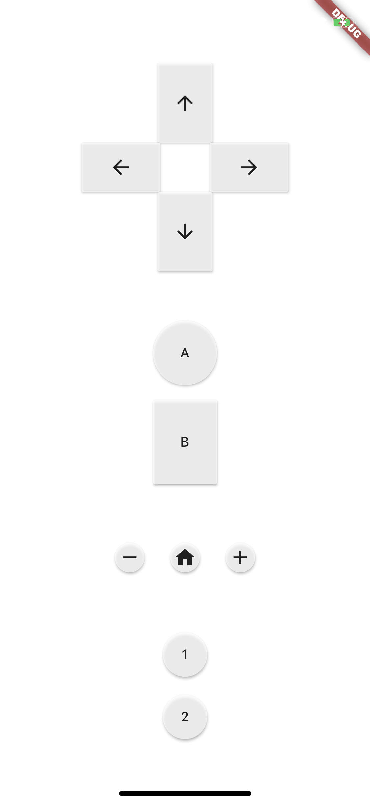
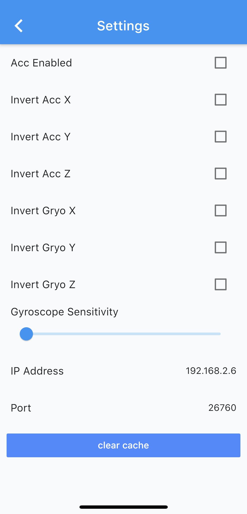

# WiiMoteDSU

## Build & Run

- Make sure you have the Flutter SDK installed on your computer, for more info see [Flutter Getting Started](https://flutter.dev/docs/get-started/install).
- Connect your Android or iOS device to your computer and make sure it is listed when you run `flutter devices` in the terminal.
- Run inside project directory: `flutter run` to build and run the application on your mobile device.

## Dolphin

If you want to use this application with the Dolphin emulator, select other input devices and
fill in your phones IP address and port 26760. Moreover, a controller profile configuration file
can be found in this repository, which should work for most games (some games using motion input
may be troublesome, although implemented).

### More detailed steps

**Note:** While the screenshots are from the Dolphin application for Mac OS, the same holds (and has been tested) for the Windows version.

1. Open _Controller Settings_
2. Click _Alternate Input Sources_
3. Check _Enable_
4. Fill in your phone's IP Address and port number `26760`.
5. Select _Emulated Wii Remote_ as "Wii Remote 1" and click **Configure**.
6. While the application is open on your phone, "DSUClient/0/DualShock 3" (your phone) should be listed as possible input device, select it as input device.

   

7. You can now either map the buttons manually or use the `WiiMoteDSU.ini` profile file in this repository:
   1. If using the profile from this repository place it within the Config folder of Dolhpin:
      - Windows: `(Documents/Dolphin Emulator/)Config/Profiles/Wiimote/WiiMoteDSU.ini`
      - Mac OS: `/Users/username/Library/Application Support/Dolphin/Config/Profiles/Wiimote/WiiMoteDSU.ini`
   2. When placed in this folder you can type "WiiMoteDSU" as profile and press 'Load' on the controller configuration screen.
       
       
      **Note:** Set _Extension_ to "None", something else (like Nunchunk) can override button mappings.

#### Extra: Pad Test (Windows only)

If you don't see your phone as controller appearing in the list while configuring an "Emulated Wii Remote" you can test whether the connection works using the [DSU Pad Test](https://files.sshnuke.net/PadTest_1011.zip) application:

## Credits

A lot of this application's code was made possible by looking at an existing DSU server
implementation for Joy Con controllers at https://github.com/joaorb64/joycond-cemuhook/tree/master

Also the specification of the DSU protocol at https://v1993.github.io/cemuhook-protocol/ is of
great value

## Screenshots

